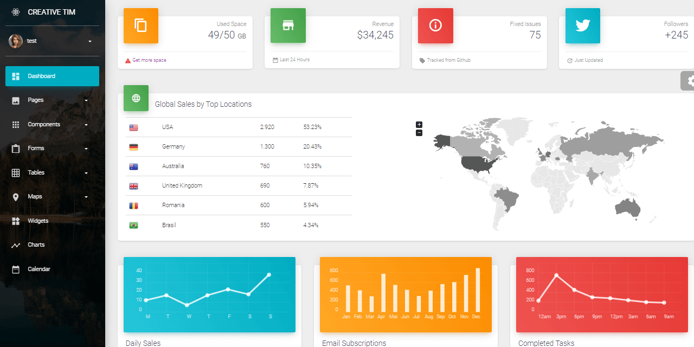

# Material Dashboard PRO React Nodejs

Full-stack version of **Material Dashboard PRO React**, a premium design now usable with a lightweight Node JS API Backend. The UI comes with pre-configured **JWT authentication **powered by the NodeJS backend available in two database options: SQLite and MongoDB.&#x20;

* [Material Dashboard PRO React Nodejs](https://creative-tim.com/product/material-dashboard-pro-react-nodejs) - product page
* [Material Dashboard PRO React Nodejs](https://www.creative-tim.com/live/material-dashboard-pro-react-nodejs) - LIVE Demo



### Product Dependencies

To successfully compile and use the product, please make sure your workstation has the right tools installed and accessible in the terminal window:

* [Node JS](https://nodejs.org/en/) 12.x version (or above) - used to build both parts (frontend & backend)
* [GIT](https://git-scm.com) versioning command-line tool - used to clone the sources from Github
* A code editor: [VsCode](https://code.visualstudio.com) or [Atom](https://atom.io)
* Ability to work in the terminal window
* (optional) [Yarn](https://yarnpkg.com) - a popular package manager for NodeJS&#x20;

&#x20;&#x20;

### Product Features

The product aims to help developers skip over the basics and start faster a new full-stack product already enhanced with authentication, a pixel-perfect UI powered by production-ready API Backend. Once the product is up and running (backend and frontend) the UI redirects the guest users to the login page. Once the user is authenticated, all private pages are unlocked.&#x20;

.png>)


### **How to use the product**

**Material Dashboard PRO React Nodejs** is built using a two-tier architecture where the UI is decoupled from the backend API server and communicates using requests secured by **JWT tokens**. The recommended way to start using this full-stack product is to follow a simple setup:&#x20;

* Step #1 - Build and start the backend server
* Step #2 - Build and start the UI
* Create a new user via the registration page
* Authenticate and access the private pages
* Add new features on top of the existing codebase.&#x20;


### Start the NodeJS API Server

As mentioned before, the NodeJS API is provided in two versions:

* SQLite persistence powered by [TypeORM](https://typeorm.io/#/)
* MongoDB managed by [Mongoose](https://mongoosejs.com) library&#x20;

Both versions expose a Unified API Interface that provides an identical API signature compatible with the React User Interface.&#x20;


#### Start the SQLite API version&#x20;

> &#x20;**Step #1** - **Download the ZIP** archive from your dashboard

```bash
$ unzip api-server-nodejs-pro.zip
$ cd api-server-nodejs-pro
```

> **Step #2 - Install dependencies** via NPM or Yarn

```
$ npm i
// OR
$ yarn
```

> **Step #3 - Run the SQLite migration **and create the required tables

```
$ yarn typeorm migration:run
```

> **Step #4 - Start the API server** - development mode

```
$ npm dev
// OR
$ yarn dev
```

The API interface used by the API is a simple JWT authentication layer that exposes the following methods:&#x20;

* USERS API:
  * `/api/users/register`: create a new user
  * `/api/users/login`: authenticate an existing user
  * `/api/users/logout`: delete the associated JWT token
  * `/api/users/checkSession`: check an existing JWT Token for validity
  * `/api/users/edit` - edit the information associated with a registered user&#x20;

At this point, the backend API should be & and running on address: `http://localhost:5000`  and we can move on with the setup and build the React UI.


#### Start the Mongo API version

> &#x20;**Step #1** - **Download the ZIP** archive from your dashboard

```bash
$ unzip api-server-nodejs-pro-mongo.zip
$ cd api-server-nodejs-pro-mongo
```

> **Step #2 - Install dependencies** via NPM or Yarn

```
$ npm i
// OR
$ yarn
```

> **Step #3 - Start the API server** - development mode

```
$ npm run dev
// OR
$ yarn dev
```

> **Step #4 - Start the API server** for production  (files served from `build/build/index.js`)

```
$ npm run build
// OR
$ yarn build
```

The API interface used by the API is a simple JWT authentication layer that exposes the following methods:&#x20;

* USERS API:
  * `/api/users/register`: create a new user
  * `/api/users/login`: authenticate an existing user
  * `/api/users/logout`: delete the associated JWT token
  * `/api/users/checkSession`: check an existing JWT Token for validity
  * `/api/users/edit` - edit the information associated with a registered user&#x20;


> Mongo Settings - the Mongo URI lives in `config/keys.js`

```
... = 'mongodb://localhost/api_server_nodejs'
```

At this point, the backend API should be & and running on address: `http://localhost:5000`  and we can move on with the setup and build the React UI.&#x20;


### Start the React UI&#x20;

> **Step #1** - **Download the ZIP** archive from your dashboard

```
$ unzip material-dashboard-pro-react.zip
$ cd material-dashboard-pro-react
```

> **Step #2** - Install dependencies via NPM or yarn

```
$ npm i
// OR
$ yarn
```

> **Step #3** - Start in development mode

```
$ npm run start 
// OR
$ yarn start
```

&#x20;At this point, the React UI should be up and running in the browser `http://localhost:3000` and we can create new users and sign in.&#x20;

&#x20;&#x20;

### Backend Integration

> The backend API server address is saved in `src/config/constant.js`.

```
export const API_SERVER = "http://localhost:5000/api/";
```

> Frontend api has been created at `src/api/auth.js`.

```
const axios = Axios.create({
    baseURL: `${baseURL}/api`,
    headers: { "Content-Type": "application/json" },
});
```


Links and Resources

* [Support Page](https://www.creative-tim.com/support) - in case of any issues
* See more [React Products](https://www.creative-tim.com/templates/react) provided by Creative-Tim&#x20;
