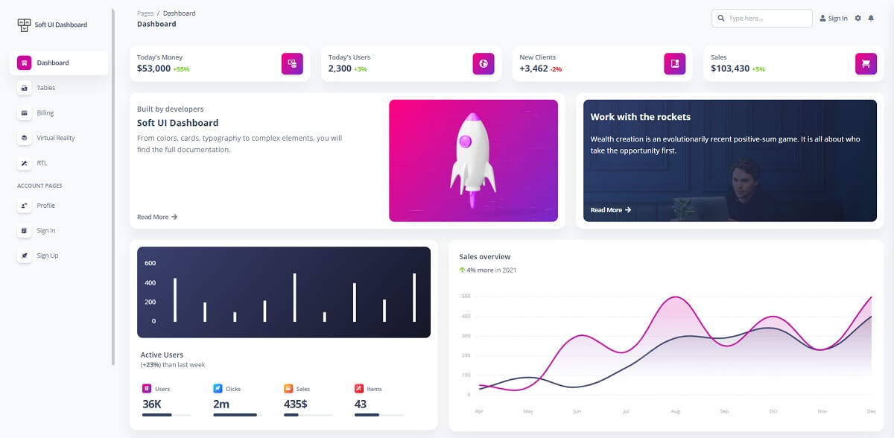
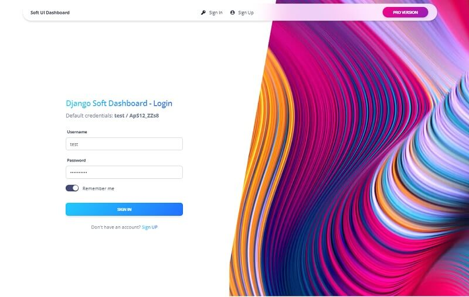

# Soft UI Dashboard Django

A simple open-source project that uses Django as the backend framework and **Soft Dashboard** for the UI. For newcomers, Soft UI Dashboard is a modern Bootstrap 5 design built with over 70 frontend individual elements, like buttons, inputs, navbars, nav tabs, cards, and **Django** is a leading web framework coded by programming experts.&#x20;

* [Soft UI Dashboard Django](https://www.creative-tim.com/product/soft-ui-dashboard-django) - product page
* [Soft UI Dashboard Django](https://www.creative-tim.com/live/soft-ui-dashboard-django) - LIVE Demo



### Product Features&#x20;

* Up-to-date dependencies: **Django 3.2.6 LTS**
* SCSS compilation via **Gulp**
* UI Kit: **Soft UI Dashboard** (Free Version)
* SQLite Database, Django Native ORM
* Modular design, clean codebase
* Session-Based Authentication, Forms validation
* Deployment scripts: Docker, Gunicorn / Nginx


### How to compile the product

In order to have a successful build, a [minimal programming kit](https://docs.appseed.us/content/tutorials/minimal-programming-kit) is required: Python3, GIT, and a modern code editor like VsCode or Atom. Once all the tools are installed and accessible via the terminal, we can start compiling the product in a local environment:&#x20;

**Step #1** - Download the sources from the [product page](https://www.creative-tim.com/product/soft-ui-dashboard-django)

```bash
$ unzip soft-ui-dashboard-django.zip
$ cd soft-ui-dashboard-django 
```

**Step 2** - Create a virtual environment and install the dependencies

```bash
$ # Virtualenv modules installation (Unix based systems)
$ virtualenv env
$ source env/bin/activate
$
$ # Virtualenv modules installation (Windows based systems)
$ # virtualenv env
$ # .\env\Scripts\activate
$
$ # Install modules - SQLite Storage
$ pip3 install -r requirements.txt
```

**Step #3** - Set up the database

```bash
$ python manage.py makemigrations
$ python manage.py migrate
```

**Step #4** - Start the app

```bash
$ python manage.py runserver
$
$ # Access the app in the browser: http://127.0.0.1:8000/
```

At this point, Soft UI Dashboard Django should be up and running in the browser on port `8000`.&#x20;



### Codebase structure

The product comes with a simple, intuitive structure as shown below:

```bash
< PROJECT ROOT >
   |
   |-- core/                               # Implements app configuration
   |    |-- settings.py                    # Defines Global Settings
   |    |-- wsgi.py                        # Start the app in production
   |    |-- urls.py                        # Define URLs served by all apps/nodes
   |
   |-- apps/
   |    |
   |    |-- home/                          # A simple app that serve HTML files
   |    |    |-- views.py                  # Serve HTML pages for authenticated users
   |    |    |-- urls.py                   # Define some super simple routes  
   |    |
   |    |-- authentication/                # Handles auth routes (login and register)
   |    |    |-- urls.py                   # Define authentication routes  
   |    |    |-- views.py                  # Handles login and registration  
   |    |    |-- forms.py                  # Define auth forms (login and register) 
   |    |
   |    |-- static/
   |    |    |-- <css, JS, images>         # CSS files, Javascripts files
   |    |
   |    |-- templates/                     # Templates used to render pages
   |         |-- includes/                 # HTML chunks and components
   |         |    |-- navigation.html      # Top menu component
   |         |    |-- sidebar.html         # Sidebar component
   |         |    |-- footer.html          # App Footer
   |         |    |-- scripts.html         # Scripts common to all pages
   |         |
   |         |-- layouts/                   # Master pages
   |         |    |-- base-fullscreen.html  # Used by Authentication pages
   |         |    |-- base.html             # Used by common pages
   |         |
   |         |-- accounts/                  # Authentication pages
   |         |    |-- login.html            # Login page
   |         |    |-- register.html         # Register page
   |         |
   |         |-- home/                      # UI Kit Pages
   |              |-- index.html            # Index page
   |              |-- 404-page.html         # 404 page
   |              |-- *.html                # All other pages
   |
   |-- requirements.txt                     # Development modules - SQLite storage
   |
   |-- .env                                 # Inject Configuration via Environment
   |-- manage.py                            # Start the app - Django default start script
   |
   |-- ************************************************************************
```

****

**The bootstrap flow**&#x20;

* Django bootstrapper `manage.py` uses `core/settings.py` as the main configuration file
* `core/settings.py` loads the app magic from `.env` file
* Redirect the guest users to `Login` page
* Unlock the pages served by `app` node for authenticated users


### Recompile CSS

To recompile SCSS files, follow this setup:

**Step #1** - Install tools

* [NodeJS](https://nodejs.org/en/) 12.x or higher
* [Gulp](https://gulpjs.com) - globally
  * `npm install -g gulp-cli`
* [Yarn](https://yarnpkg.com) (optional)&#x20;

**Step #2** - Change the working directory to `assets` folder

```bash
$ cd apps/static/assets
```

**Step #3** - Install modules (this will create a classic `node_modules` directory)

```bash
$ npm install
// OR
$ yarn
```

**Step #4** - Edit & Recompile SCSS files

```bash
$ gulp scss
```

The generated file is saved in `apps/static/assets/css` directory.


### Start in Docker

The project can be started in Docker, the popular virtualization software, with just a few commands typed in the terminal:

**Step #1** - Download the sources from the [product page](https://www.creative-tim.com/product/soft-ui-dashboard-django)

```bash
$ unzip soft-ui-dashboard-django.zip
$ cd soft-ui-dashboard-django 
```

**Step #2** - Execute Docker commands (inside sources directory)

```bash
$ docker-compose pull   # download the packages 
$ docker-compose build  # execute local set up
$ docker-compose up     # start the project 
```

Visit `http://localhost:85` in your browser. The app should be up & running.


### Links and Resources

* Use Github to report [issues](https://github.com/creativetimofficial/soft-ui-dashboard-django/issues)&#x20;
* Join the community on [Discord](https://discord.gg/pbr6WF53)&#x20;
* Take a look at the [premium version](https://www.creative-tim.com/product/soft-ui-dashboard-pro-django) for more pages and components&#x20;
